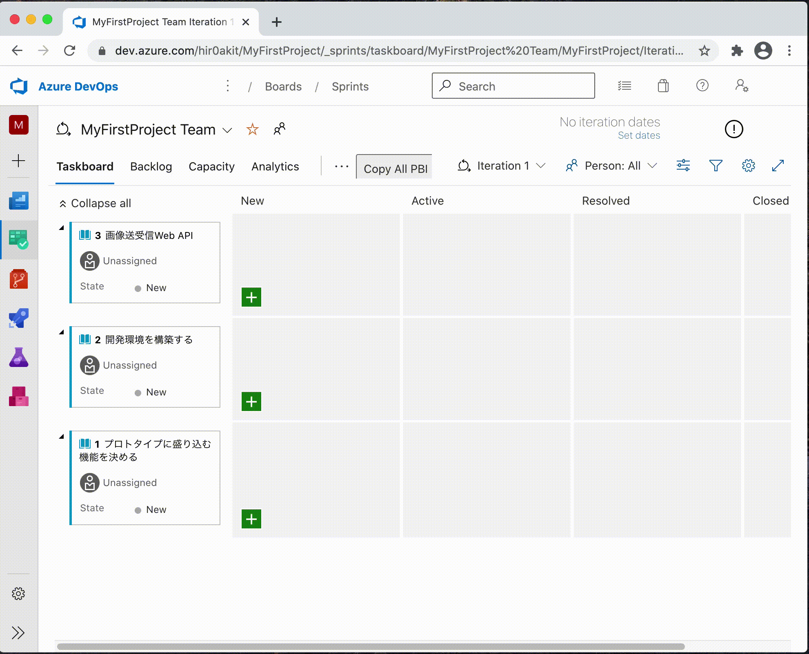
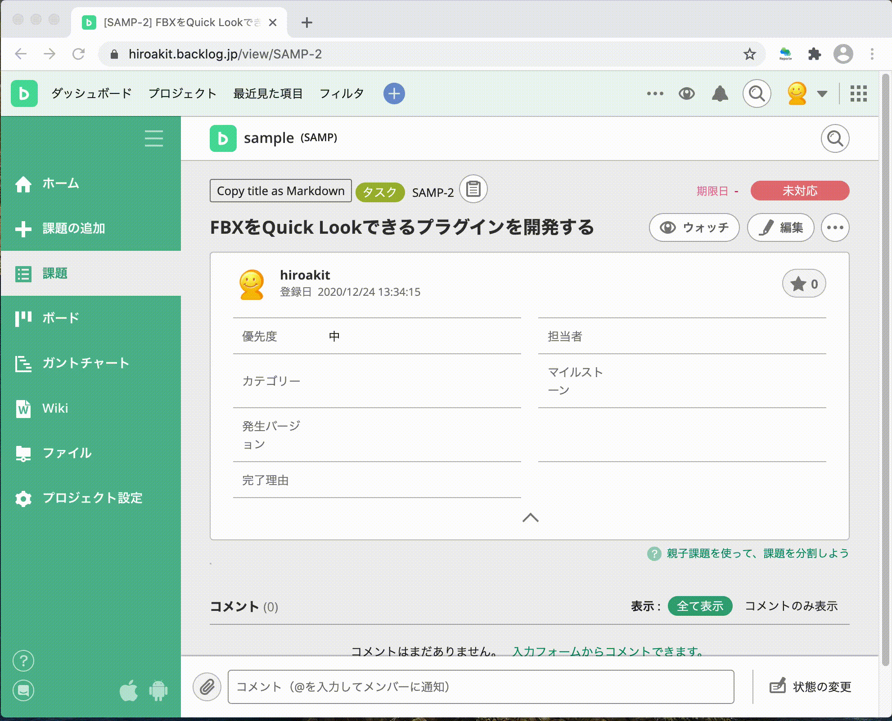
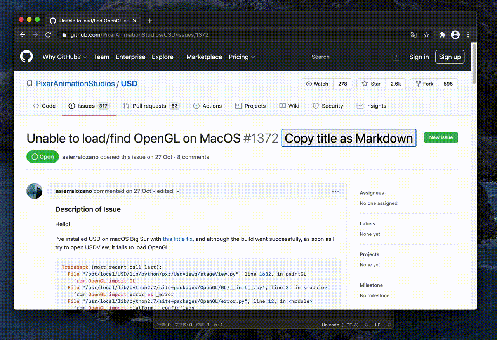
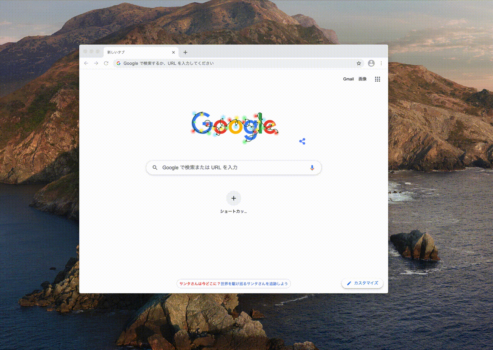

# ReportSharp-BrowserExt

ReportSharp-BrowserExt provide a reporting process that is simple and clean from your web browser.  
Supporting Google Chrome, Microsoft Edge.

## Azure DevOps



Capabilities

- Copy item title with url as the Markdown format.

## Backlog



Capabilities

- Copy ticket title with url as the Markdown format.
- Copy wiki page title with url as the Markdown format.

## Build



Capabilities

- Copy issue title with url as the Markdown format.
- Copy pr title with url as the Markdown format.

## Build

```sh
# debug build
npm run build

# release build
npm run publish 
```

## Installation

**Via store**

- TBD

**Via local**




## LICENSE

MIT
